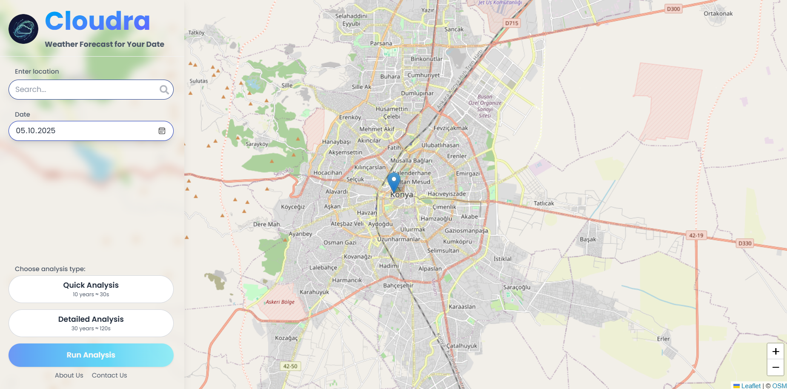
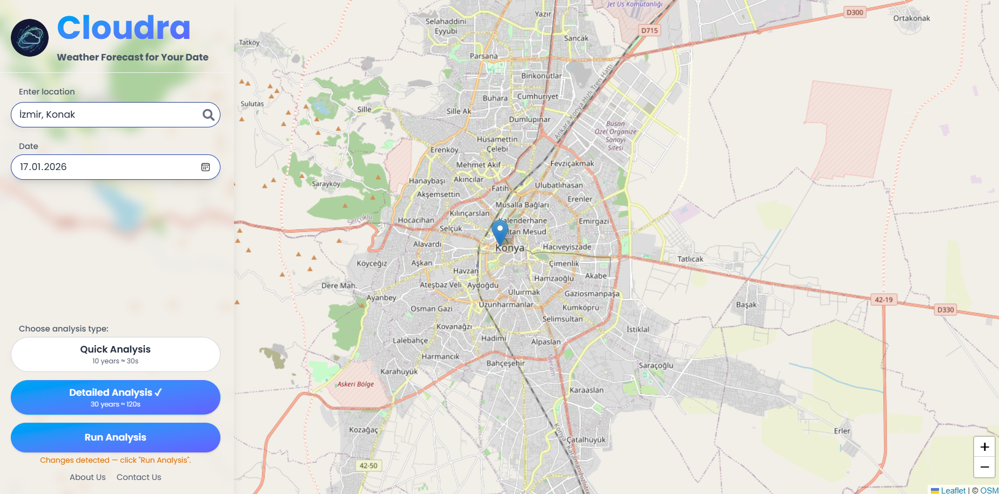
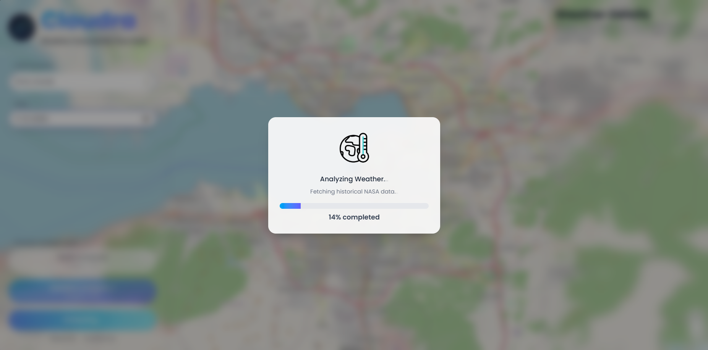
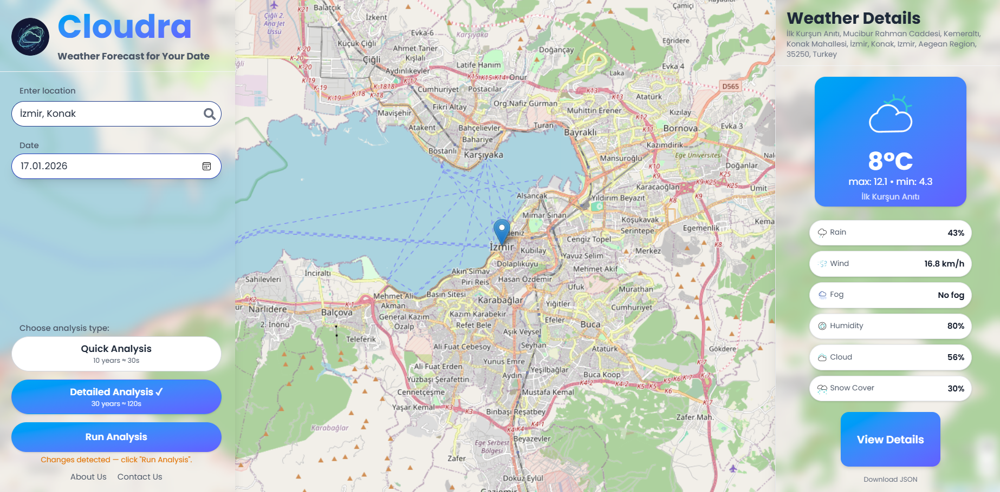
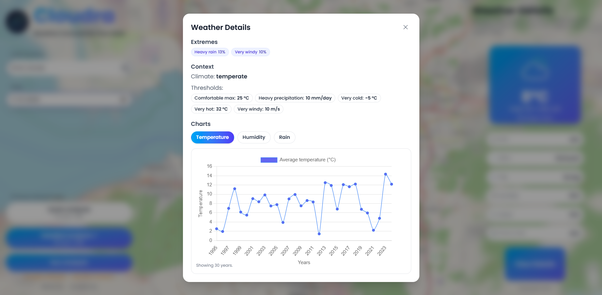
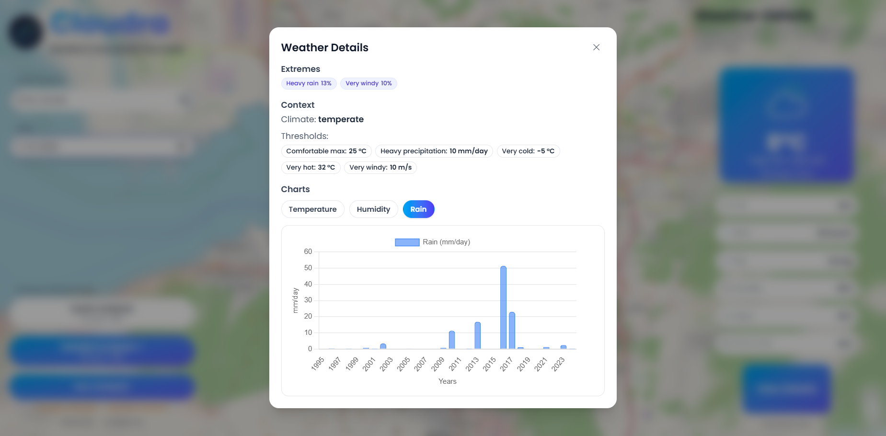

# Will It Rain On My Parade?

Read about the project before getting started: [ABOUT THE PROJECT](https://github.com/SoAp9035/selcuk-space-app/blob/main/PROJECT.md)

Read the notes taken by team members: [NOTES](https://github.com/SoAp9035/selcuk-space-app/blob/main/NOTES.md)

Read the API documentation here: [DOCS](https://github.com/SoAp9035/selcuk-space-app/blob/main/DOCS.md)

Read the analysis here: [ANALYSIS](https://github.com/SoAp9035/selcuk-space-app/blob/main/ANALYSIS.md)

Presentation file: [PRESENTATION](https://github.com/SoAp9035/selcuk-space-app/blob/main/PRESENTATION.md)

## Screenshots








## Getting Started

You will need to install [uv](https://docs.astral.sh/uv/) and [Node.js](https://nodejs.org/en/download) in your system.

Run these commands to start building:
```
git clone https://github.com/SoAp9035/selcuk-space-app.git
cd selcuk-space-app
```

## How to run the backend

```
cd backend
```

```
uv run main.py
```

## How to run the frontend

Not forget to install dependinceise first:

```
cd frontend
npm install
```

To run:

```
npm run dev
```

## How to update the project

```
git pull
```

## How to push the changes you made

```
git add .
git commit -m "Your Message"
git push -u origin main
```

Warning: Before pushing, please pull the project first.